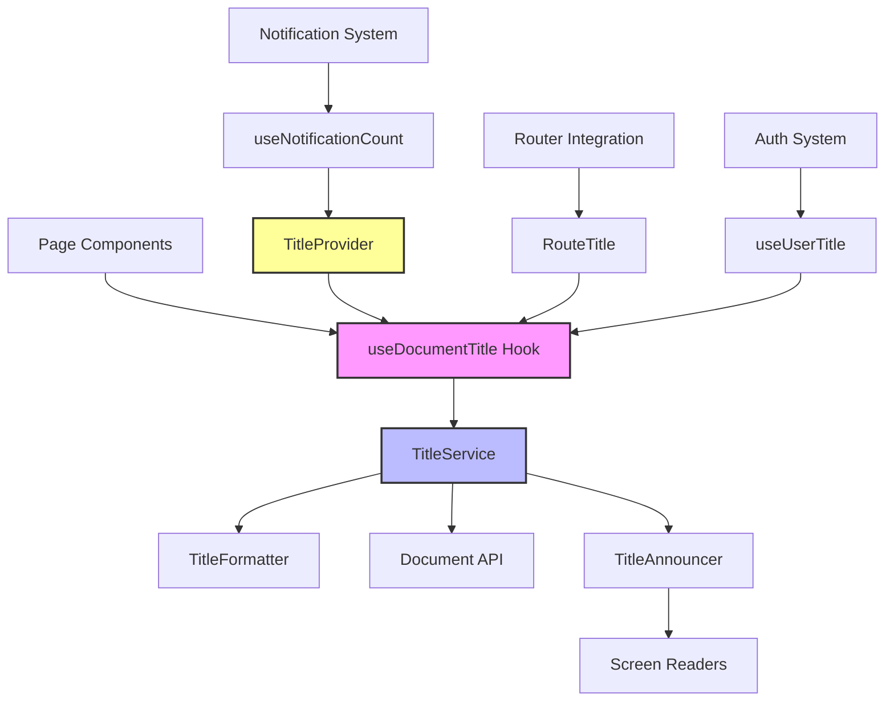

# Title System Documentation

## Overview

The Linke User Portal includes a comprehensive dynamic title management system that provides context-aware browser titles with advanced features like loading states, notification counts, user information, and accessibility support.

## Table of Contents

- [Architecture](#architecture)
- [Quick Start](#quick-start)
- [Components](#components)
- [Hooks](#hooks)
- [Configuration](#configuration)
- [Advanced Features](#advanced-features)
- [Testing](#testing)
- [Troubleshooting](#troubleshooting)
- [Migration Guide](#migration-guide)

## Architecture



### Core Components

1. **TitleService**: Central singleton managing all title operations
2. **TitleFormatter**: Handles formatting, sanitization, and truncation
3. **TitleProvider**: React Context for global state management
4. **useDocumentTitle**: Primary hook for component-level title management
5. **RouteTitle**: Automatic route-based title updates
6. **TitleAnnouncer**: Accessibility announcements for screen readers

## Quick Start

### Basic Usage

```tsx
import { useDocumentTitle } from '@/hooks/useDocumentTitle';

function MyPage() {
  useDocumentTitle({
    title: 'My Page',
    showUsername: true,
    showNotificationCount: true,
  });

  return <div>Page content</div>;
}
```

### Static Title

```tsx
import { useStaticTitle } from '@/hooks/useDocumentTitle';

function LoginPage() {
  useStaticTitle('Login');
  return <div>Login form</div>;
}
```

### Loading States

```tsx
import { useLoadingTitle } from '@/hooks/useDocumentTitle';

function DataPage() {
  const { data, isLoading } = useQuery('data');

  useLoadingTitle('Data Loading', isLoading);

  return <div>{data ? 'Loaded' : 'Loading...'}</div>;
}
```

### User-Specific Titles

```tsx
import { useUserTitle } from '@/hooks/useDocumentTitle';
import { useCurrentUser } from '@/features/auth/stores/authStore';

function ProfilePage() {
  const user = useCurrentUser();

  useUserTitle('Profile', user?.username, {
    showNotificationCount: true,
  });

  return <div>Profile content</div>;
}
```

## Components

### TitleProvider

Wraps your application to provide global title state management.

```tsx
import { TitleProvider } from '@/contexts/TitleContext';

function App() {
  return (
    <TitleProvider
      config={{
        appName: 'My App',
        maxLength: 60,
        separator: ' | ',
      }}
      debug={process.env.NODE_ENV === 'development'}
    >
      <Router>{/* Your app content */}</Router>
    </TitleProvider>
  );
}
```

**Props:**

- `config?: Partial<TitleConfig>` - Custom title configuration
- `debug?: boolean` - Enable debug logging
- `children: ReactNode` - Child components

### RouteTitle

Automatically manages titles based on current route.

```tsx
import { RouteTitle } from '@/components/RouteTitle';

function RootLayout() {
  return (
    <div>
      <RouteTitle />
      <Outlet />
    </div>
  );
}
```

**Props:**

- `title?: string` - Override title for current route
- `showUsername?: boolean` - Include username in title
- `customFormat?: (title: string) => string` - Custom title formatter

## Hooks

### useDocumentTitle

Primary hook for managing document titles.

```tsx
interface UseDocumentTitleOptions {
  title: string;
  showUsername?: boolean;
  showNotificationCount?: boolean;
  isLoading?: boolean;
  dependencies?: any[];
}

function useDocumentTitle(options: UseDocumentTitleOptions): void;
```

**Example:**

```tsx
function MyComponent() {
  const { data, isLoading } = useQuery('data');
  const user = useCurrentUser();

  useDocumentTitle({
    title: 'Dashboard',
    showUsername: true,
    showNotificationCount: true,
    isLoading,
    dependencies: [data, user],
  });
}
```

### useStaticTitle

Simplified hook for static titles.

```tsx
function useStaticTitle(title: string): void;
```

### useLoadingTitle

Hook for loading state management.

```tsx
function useLoadingTitle(title: string, isLoading: boolean): void;
```

### useUserTitle

Hook for user-specific titles.

```tsx
function useUserTitle(
  title: string,
  username?: string,
  options?: Partial<UseDocumentTitleOptions>
): void;
```

### useNotificationTitle

Hook for notification-aware titles.

```tsx
function useNotificationTitle(
  title: string,
  notificationCount: number,
  options?: Partial<UseDocumentTitleOptions>
): void;
```

### useTitleInfo

Hook to access current title state.

```tsx
function useTitleInfo(): TitleState;
```

## Configuration

### TitleConfig

```tsx
interface TitleConfig {
  appName: string; // "Linke User Portal"
  separator: string; // " - "
  maxLength: number; // 60
  loadingPrefix: string; // "Loading... "
  stillLoadingPrefix: string; // "Still loading... "
  stillLoadingThreshold: number; // 3000ms
  notificationFormat: string; // "(%count%) "
  truncationSuffix: string; // "..."
  usernameMaxLength: number; // 20
}
```

### Route Metadata

Configure route-specific title behavior:

```tsx
// src/config/routeMetadata.ts
export const ROUTE_METADATA: RouteMetadata[] = [
  {
    path: '/dashboard',
    title: 'Dashboard',
    showUsername: true,
    showNotifications: true,
  },
  {
    path: '/login',
    title: 'Login',
    showUsername: false,
    showNotifications: false,
  },
  // ... more routes
];
```

## Advanced Features

### Notification Integration

```tsx
import { useNotificationCount } from '@/features/notifications/hooks/useNotificationCount';

function NotificationProvider() {
  const { unreadCount } = useNotificationCount({
    updateTitle: true,
    fetchInterval: 30000,
  });

  return <NotificationList count={unreadCount} />;
}
```

### Loading State Management

```tsx
import { useLoadingTitle } from '@/hooks/useLoadingTitle';

function DataComponent() {
  const { startLoading, stopLoading, isLoading } = useLoadingTitle({
    baseTitle: 'Data Management',
    updateGlobalState: true,
  });

  const fetchData = async () => {
    const loadingId = startLoading('Fetching user data');
    try {
      const data = await api.getData();
      // Process data
    } finally {
      stopLoading(loadingId);
    }
  };
}
```

### Accessibility Support

The system automatically provides screen reader announcements:

```tsx
// Automatic announcements for:
// - Navigation changes
// - Loading state changes
// - Content updates

// Manual announcements:
import { announceNavigation } from '@/utils/titleAnnouncer';

announceNavigation('New Page Loaded', 'Previous Page');
```

### Browser Compatibility

The system includes polyfills for older browsers:

```tsx
import {
  initializeTitlePolyfill,
  getBrowserSupport,
} from '@/utils/titlePolyfill';

// Initialize polyfill
const support = initializeTitlePolyfill({
  logWarnings: true,
  useAutomaticFallback: true,
});

console.log('Browser support:', support);
```

### Security Features

Built-in XSS protection and content sanitization:

```tsx
import { sanitizeTitle, isValidTitle } from '@/utils/titleSanitizer';

const userInput = '<script>alert("xss")</script>Dashboard';
const safeTile = sanitizeTitle(userInput); // "Dashboard"
const isValid = isValidTitle(userInput); // false
```

## Testing

### Unit Tests

```tsx
import { renderHook } from '@testing-library/react';
import { useDocumentTitle } from '@/hooks/useDocumentTitle';
import { TitleProvider } from '@/contexts/TitleContext';

const wrapper = ({ children }) => <TitleProvider>{children}</TitleProvider>;

test('should update title', () => {
  renderHook(() => useDocumentTitle({ title: 'Test Page' }), { wrapper });

  expect(document.title).toContain('Test Page');
});
```

### Integration Tests

```tsx
import { render, screen } from '@testing-library/react';
import { MemoryRouter } from 'react-router-dom';
import { TitleProvider } from '@/contexts/TitleContext';
import { RouteTitle } from '@/components/RouteTitle';

test('should update title on navigation', async () => {
  render(
    <TitleProvider>
      <MemoryRouter initialEntries={['/dashboard']}>
        <RouteTitle />
        <Routes>
          <Route path='/dashboard' element={<DashboardPage />} />
        </Routes>
      </MemoryRouter>
    </TitleProvider>
  );

  await waitFor(() => {
    expect(document.title).toContain('Dashboard');
  });
});
```

## Troubleshooting

### Common Issues

#### Title not updating

1. **Check TitleProvider**: Ensure your app is wrapped with `TitleProvider`
2. **Verify dependencies**: Include all reactive values in the `dependencies` array
3. **Check browser console**: Look for errors or warnings

```tsx
// ❌ Missing dependencies
useDocumentTitle({
  title: `Page ${pageId}`,
  // dependencies: [pageId], // Missing!
});

// ✅ Correct dependencies
useDocumentTitle({
  title: `Page ${pageId}`,
  dependencies: [pageId],
});
```

#### Titles appearing too long

1. **Adjust maxLength**: Modify the configuration
2. **Use shorter base titles**: Keep page names concise
3. **Custom formatting**: Implement custom title formatter

```tsx
<TitleProvider
  config={{
    maxLength: 50, // Reduce from default 60
    usernameMaxLength: 15, // Reduce from default 20
  }}
>
```

#### Loading states not showing

1. **Check loading detection**: Ensure `isLoading` prop is correctly passed
2. **Verify timing**: Loading states are debounced by 100ms
3. **Check configuration**: Verify loading prefixes are configured

```tsx
// ❌ Static loading state
useDocumentTitle({
  title: 'Page',
  isLoading: true, // Always true!
});

// ✅ Dynamic loading state
const { isLoading } = useQuery('data');
useDocumentTitle({
  title: 'Page',
  isLoading, // Reactive to actual loading state
});
```

#### Accessibility not working

1. **Check browser support**: Verify ARIA support
2. **Enable announcements**: Ensure accessibility features are enabled
3. **Test with screen readers**: Use actual assistive technology

```tsx
import { initializeAnnouncer } from '@/utils/titleAnnouncer';

// Enable accessibility
initializeAnnouncer({
  enabled: true,
  politeness: 'polite',
});
```

### Debug Mode

Enable debug mode for detailed logging:

```tsx
<TitleProvider debug={true}>{/* Your app */}</TitleProvider>
```

Debug mode logs:

- Title updates and changes
- Loading state transitions
- Notification count changes
- Accessibility announcements
- Error conditions

### Performance Issues

If experiencing performance issues:

1. **Reduce update frequency**: Increase debounce timing
2. **Optimize dependencies**: Only include necessary reactive values
3. **Use static titles**: For pages that don't need dynamic features

```tsx
// Custom debounce timing
const titleService = TitleService.getInstance();
// Default is 50ms, increase if needed
```

## Migration Guide

### From Static Titles

If upgrading from static HTML titles:

1. **Wrap with TitleProvider**:

```tsx
// Before
function App() {
  return <Router>{/* content */}</Router>;
}

// After
function App() {
  return (
    <TitleProvider>
      <Router>{/* content */}</Router>
    </TitleProvider>
  );
}
```

2. **Add RouteTitle component**:

```tsx
// Add to your root layout
function RootLayout() {
  return (
    <div>
      <RouteTitle />
      <Outlet />
    </div>
  );
}
```

3. **Update page components**:

```tsx
// Before
function DashboardPage() {
  useEffect(() => {
    document.title = 'Dashboard - My App';
  }, []);

  return <div>Content</div>;
}

// After
function DashboardPage() {
  useDocumentTitle({
    title: 'Dashboard',
    showUsername: true,
  });

  return <div>Content</div>;
}
```

### From React Helmet

If migrating from React Helmet:

1. **Replace Helmet imports**:

```tsx
// Before
import { Helmet } from 'react-helmet';

// After
import { useDocumentTitle } from '@/hooks/useDocumentTitle';
```

2. **Update component usage**:

```tsx
// Before
function MyPage() {
  return (
    <>
      <Helmet>
        <title>My Page - App</title>
      </Helmet>
      <div>Content</div>
    </>
  );
}

// After
function MyPage() {
  useDocumentTitle({ title: 'My Page' });
  return <div>Content</div>;
}
```

### Configuration Migration

Migrate your title configuration:

```tsx
// Before (manual)
document.title = `${pageTitle} - ${username} - ${appName}`;

// After (configured)
<TitleProvider
  config={{
    appName: 'Your App Name',
    separator: ' - ',
    maxLength: 60,
  }}
>
```

## API Reference

### Types

```tsx
interface TitleConfig {
  appName: string;
  separator: string;
  maxLength: number;
  loadingPrefix: string;
  stillLoadingPrefix: string;
  stillLoadingThreshold: number;
  notificationFormat: string;
  truncationSuffix: string;
  usernameMaxLength: number;
}

interface TitleState {
  currentTitle: string;
  baseTitle: string;
  isLoading: boolean;
  loadingStartTime?: number;
  notificationCount: number;
  username?: string;
  lastUpdate: number;
}

interface UseDocumentTitleOptions {
  title: string;
  showUsername?: boolean;
  showNotificationCount?: boolean;
  isLoading?: boolean;
  dependencies?: any[];
}

interface RouteMetadata {
  path: string;
  title: string;
  showUsername?: boolean;
  showNotifications?: boolean;
  customFormatter?: (title: string) => string;
}
```

### Services

```tsx
class TitleService {
  static getInstance(): TitleService;
  setTitle(title: string): void;
  setLoadingState(isLoading: boolean): void;
  setNotificationCount(count: number): void;
  setUserContext(username?: string): void;
  updateWithParts(parts: TitleParts): void;
  getCurrentTitle(): string;
  getState(): TitleState;
  reset(): void;
  cleanup(): void;
}

class TitleFormatter {
  format(parts: TitleParts): string;
  truncate(text: string, maxLength: number): string;
  sanitize(text: string): string;
  validate(title: string): { isValid: boolean; errors: string[] };
}
```

## Best Practices

1. **Use semantic titles**: Make titles descriptive and meaningful
2. **Include context**: Show username, page status, and notifications when relevant
3. **Handle loading states**: Always show loading indicators for async operations
4. **Test accessibility**: Verify with screen readers and assistive technology
5. **Monitor performance**: Use debug mode to identify bottlenecks
6. **Sanitize user input**: Never display unsanitized user content in titles
7. **Keep titles concise**: Respect the 60-character limit for browser tabs
8. **Use consistent formatting**: Follow the established title patterns

## Browser Support

- ✅ Chrome 90+
- ✅ Firefox 88+
- ✅ Safari 14+
- ✅ Edge 90+
- ⚠️ Older browsers (with polyfill)

## Contributing

When contributing to the title system:

1. **Add tests**: Include unit and integration tests for new features
2. **Update documentation**: Keep this guide current with changes
3. **Follow patterns**: Use established coding patterns and naming conventions
4. **Consider accessibility**: Ensure new features work with screen readers
5. **Test browser compatibility**: Verify across supported browsers

## License

This title system is part of the Linke User Portal project and follows the same licensing terms.
